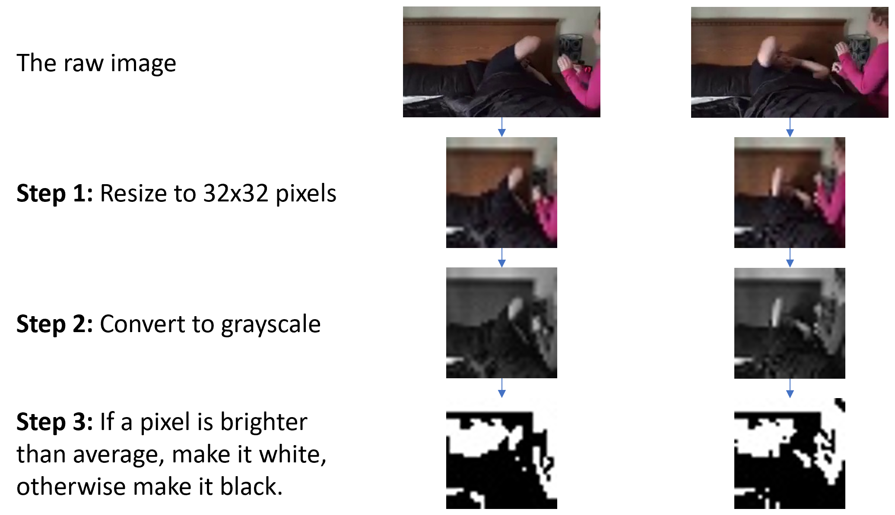
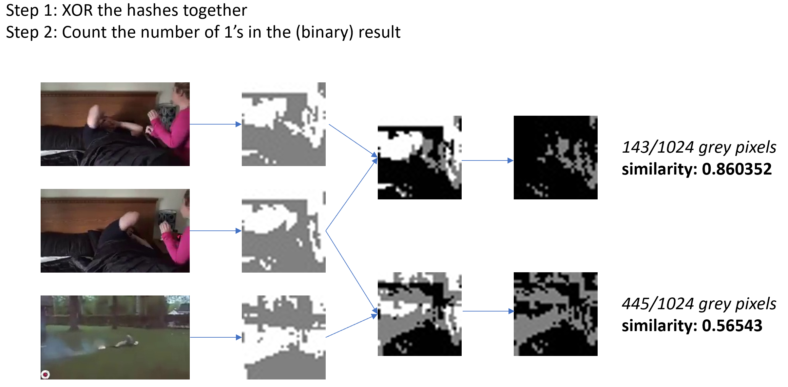
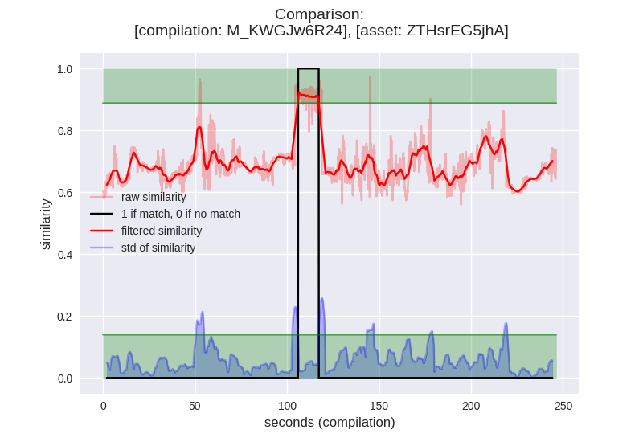

[Back to frontpage](../README.md)

# Theory
The algorithm uses video only (no audio).

## Terminology
Some basic concepts/"big words" will be used as terminology in this project:
 - ***asset***: A video that you own. Your motivation for using this project is that you wish to find your *asset* within other videos (*compilations*)
 - ***compilation***: A video often containing several different clips, where one of these might be yours. In practice, this can be any video you want to check if your asset is inside of.
 - ***frame***: A single image from a video. A video might for example have 30 such images within one second.
 - ***similarity number***: A measure for how similar one frame is to another. This is a number between 0 (completely different) and 1 (exactly the same)

### A video is simply a sequence of frames
 - This means that comparing a video, boils down to comparing frames
 - Of course a video can also have audio, but this will be ignored in this project

### "Perceptual Hash" vs "Cryptographic Hash"
 - Cryptographic hash: A small change in input causes a huge and unpredictable change in output. Good for exact matching.
 - Perceptual hash: A small change in input causes a small change in output. Good for fuzzy matching (this is what will be used for video comparison)

### A Perceptual Image Hash

### Comparing Image Hashes

### How can this be extended to video comparisons?
 - For the first frame in the ***compilation***, compare it with every frame in the ***asset***, and store the greatest ***similarity number*** from these comparisons.

 - Repeat for the rest of the frames in the compilation

 - This will result in a ***similarity sequence*** of numbers between 0 and 1, with each number corresponding to a specific frame in the compilation.

### Processing the similarity sequence
We have a sequence of numbers between 0 and 1, and we want to find potential matches in the compilation. What about simply looking for a number that is above a certain threshold?

#### Problems
 - The resulting sequence will be quite «noisy» due to the nature of the comparisons.
 - Anything lasting less than 1-2 seconds is unlikely to be a match, so we don’t want this to register as a discovery. (Consider both the asset and compilation having a single entirely black frame)
 
#### To solve these problems, two new signals will be computed
- The ***rolling average*** of the sequence with an empiric period.
  - This will act as a low pass filter, removing the highest noise frequencies.
  - If this is above a certain threshold, it is likely we have a match.
- The ***rolling standard deviation*** of the sequence with the same period.
  - This will say something about how noisy the signal is at any one point.
  - If the standard deviation is below a certain threshold, it is more likely that we can trust the rolling average.

#### If the following is true, the algorithm will register a match: 
- the rolling average is above a certain threshold
- the rolling standard deviation is also below a certain threshold
- This is happening continously for more than 1-2 seconds

## Challenges
It is likely to perform poorly on single-colored backgrounds with text (Monocolored frames with text will look very similar after being hashed)

### Some potential attacks vectors against algorithm:
- Substantial cropping
- Thick added borders
- Big watermarks
- Flipping/rotation of the video
- Inversion of video colors
- Distortions
